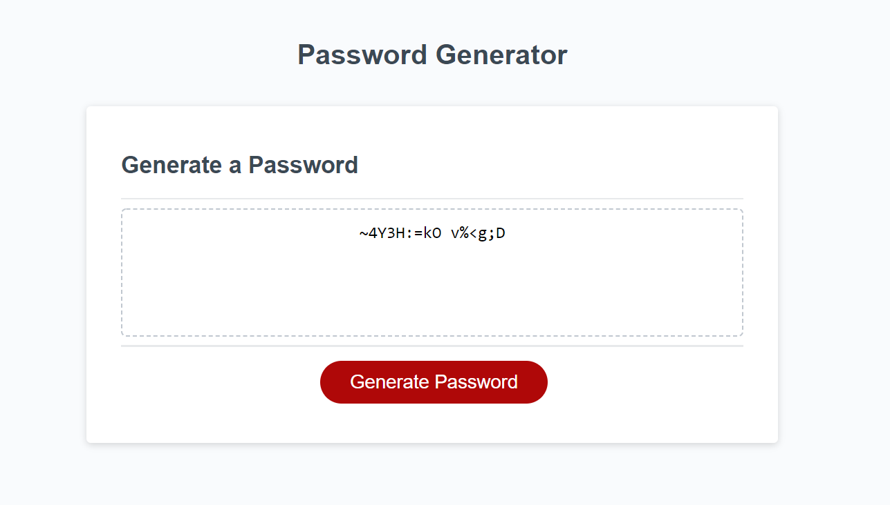

# Vincent D-Momot's Password Generator
***

Description: 
This website is to generate random passwords after being given criteria from the user

### Website Features:
1) User input for custom password requirements
2) Checks for input errors: decimals, letters and numbers not within the valid range
3) Generates a valid password that the user can copy from the page for use

### What I learned from the creation of this site:
* Better understanding of conditional statements || && != and ==
* Array and string manipulation
* Better understanding of for and while loops
* Writing a variable to a page
* Making a site use less computing power by storing variables only when needed

Generate your own password at my [Password Generator Website!](https://vincentmomot.github.io/Create-Your-Password-with-JS/)

Click [vincentmomot.github.io/Vincent-D-Momot-s-Portfolio](https://vincentmomot.github.io/Vincent-D-Momot-s-Portfolio/index) to see my other projects! 

Screenshots of the site:
